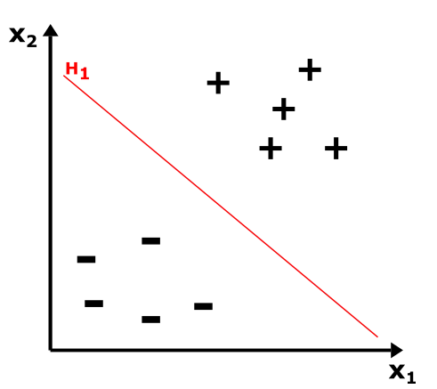
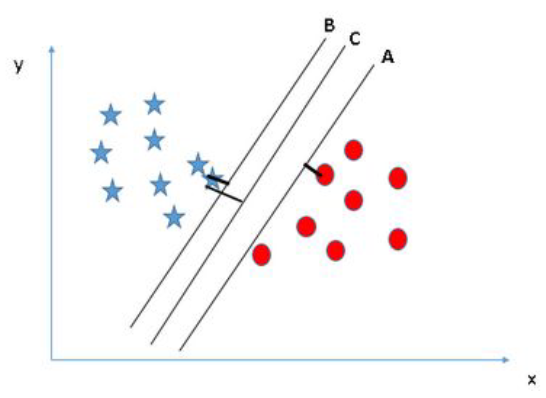

# Hiperplanos de Separação, Margem Máxima e Vetores de Suporte

## Introdução

No campo da **Aprendizagem de Máquina**, o conceito de **hiperplanos de separação**, **margem máxima** e **vetores de suporte** está diretamente relacionado aos algoritmos de classificação, particularmente ao **Support Vector Machine (SVM)**. Esses conceitos são fundamentais para entender como esses algoritmos funcionam e como conseguem criar modelos preditivos eficientes para a separação de dados.

---

## Hiperplanos de Separação

### O que é um Hiperplano?

Um **hiperplano** é uma generalização geométrica de uma linha reta. No caso de um espaço bidimensional, um hiperplano é uma linha reta que divide o espaço em duas regiões. Em um espaço tridimensional, é um plano, e em espaços de dimensões superiores, é chamado de hiperplano.

Matematicamente, um hiperplano pode ser descrito pela equação:

w * x  + b = 0

- **w**: vetor de pesos, que determina a orientação do hiperplano.
- **x**: vetor de entrada, que representa os dados.
- **b**: termo de viés, que ajusta a posição do hiperplano.

### Função de Decisão

O hiperplano separa os dados em duas classes, onde cada classe está em um lado do hiperplano. A função de decisão pode ser dada por:

- w * x  + b > 0 (classe positiva)

- w * x  + b < 0 (classe negativa)

Dessa forma, a função de decisão avalia de que lado do hiperplano os dados estão, atribuindo-os a uma classe específica.

### Separabilidade Linear

Se um conjunto de dados pode ser perfeitamente separado por um hiperplano, ele é considerado **linearmente separável**. Caso contrário, outras técnicas, como **kernels** ou **soft margins**, podem ser utilizadas para lidar com dados que não são linearmente separáveis.

---

## Margens

- **Margem**: Distância entre o hiperplano separador e o ponto de dado mais próximo.
- **Margem Máxima**: O hiperplano é ajustado para maximizar essa distância, garantindo a melhor separação possível entre as classes.

### Benefícios da Margem Máxima

- **Generalização**: Um hiperplano com maior margem tem maior probabilidade de generalizar melhor para novos dados, evitando o overfitting.
- **Robustez**: Maximizar a margem também aumenta a robustez da classificação, minimizando o impacto de ruídos ou dados atípicos.

Maximizar a margem significa minimizar a possibilidade de erro na classificação de novos dados, já que o hiperplano está o mais distante possível dos pontos mais próximos.

---

## Vetores de Suporte

### Definição

Os **vetores de suporte** são os pontos de dados que estão mais próximos do hiperplano de separação. Esses pontos são os que determinam a posição do hiperplano e, portanto, a solução final do SVM depende exclusivamente desses vetores de suporte.

### Utilidade dos Vetores de Suporte

1. **Determinam o Hiperplano**: O hiperplano de separação é definido diretamente pelos vetores de suporte. Se removêssemos outros pontos, o hiperplano não mudaria.
2. **Localização na Margem**: Os vetores de suporte estão localizados a uma distância igual do hiperplano.
3. **Dependência**: O número de vetores de suporte geralmente é pequeno, o que significa que o SVM tem uma complexidade de classificação baseada apenas nesses pontos.

### Vetores de Suporte em Espaços de Alta Dimensão

O SVM também pode ser aplicado em **espaços de alta dimensão**, onde a separação linear não é possível. Nesse caso, a técnica de **kernel trick** é usada para mapear os dados em um espaço de maior dimensão, onde a separação linear se torna viável.

---

## Conclusão

O algoritmo de Support Vector Machine (SVM) é baseado nos conceitos de **hiperplanos de separação**, **margem máxima** e **vetores de suporte**. Ele busca criar um modelo de classificação que maximize a margem entre as classes, utilizando apenas os pontos mais críticos (vetores de suporte). Esse foco na maximização da margem faz do SVM uma técnica poderosa e robusta para tarefas de classificação, especialmente quando os dados são linearmente separáveis ou podem ser mapeados para um espaço onde a separação linear é possível.

A combinação desses conceitos faz com que o SVM seja amplamente utilizado em aplicações como reconhecimento de padrões, classificação de imagens e detecção de anomalias.

## Referências
- [Support Vector Machine - Diego Addan](https://www.inf.ufpr.br/dagoncalves/IA07.pdf)
- [Modelos de Vetores de Suporte - Anderson Ara, Raydonal Ospina e Mateus Maia](http://leg.ufpr.br/~ara/teach/svm/01_introducao.html#ref-evgeniou2002regularization)
- [Máquina de Vetores de Suporte — SVM - Matheus Remigio](https://medium.com/@msremigio/m%C3%A1quinas-de-vetores-de-suporte-svm-77bb114d02fc)
- [Guide on Support Vector Machine (SVM) Algorithm](https://www.analyticsvidhya.com/support-vector-machine/)	