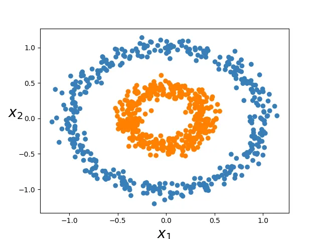
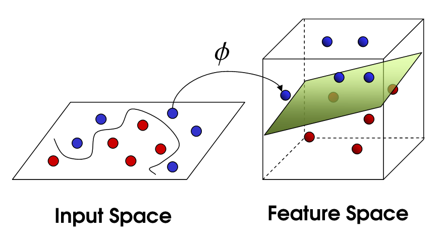

# Kernel Trick e SVMs Não Lineares

## Introdução

A ideia inicial das SVMs é encontrar um hiperplano linear que separe os dados em duas classes. No entanto, nem todos os conjuntos de dados podem ser divididos de maneira linear, um exemplo disso seriam os cenários onde os dados estão contidos em outros, como um círculo concêntrico

Para resolver esses casos, é implementado um método, conhecido por Kernel Trick, que transforma os dados para um espaço de dimensão mais alta, onde eles se tornam linearmente separáveis.

## Conceito de Kernel

Um kernel é uma função que calcula a similaridade entre duas entradas (vetores de características), mas o faz em um espaço dimensional mais alto sem precisar calcular explicitamente as coordenadas nesse novo espaço. Com isso, é possível operar de maneira eficiente, mesmo em dimensões muito elevadas.

Nesse contexto, o kernel funciona como um "atalho" matemático que permite calcular produtos escalares no espaço transformado, mas mantendo as operações no espaço original. Assim, garantindo os benefícios de transformar os dados para um espaço de maior dimensão, sem o custo computacional elevado de realizar a transformação direta.

Dessa forma, supondo que exista um conjunto de dados em 2D que não é linearmente separável. Com a aplicação do kernel, pode-se transformar para um espaço 3D onde há uma divisão linear (um plano) separando claramente as classes.

Ou seja, para um dado conjunto de pontos x e y, o kernel é equivalente à

K(x, y) = ϕ(x) ⋅ ϕ(y)

onde:

- `ϕ` é a transformação dos dados para um espaço de dimensão superior.

- `⋅` representa o produto interno no espaço de características.

Mas, em vez de calcular diretamente ϕ(x), o Kernel Trick permite obter o mesmo resultado apenas utilizando a fórmula do kernel K. Economizando tempo e memória computacional, especialmente para grandes dimensões.

## Tipos de Kernels

Há vários tipos de funções de kernel, cada uma com diferentes características e adequadas para tipos distintos de dados. Dentre eles, os que estão presentes na biblioteca SkLearn são:

- **Linear:**

  - > K(x, y) = x ⋅ y
  - O kernel linear é o mais simples e é usado quando os dados são linearmente separáveis.
  - Ele calcula o produto escalar entre os vetores de características.

- **Polinomial:**

  - > K(x, y) = (x ⋅ y + c)d
  - O kernel polinomial é eficaz para dados não lineares.
  - Ele computa a similaridade entre dois vetores em termos do polinômio das variáveis originais.

- **Função de Base Radial (RBF):**

  - > K(x, y) = exp(-ϒ||x - y||²) onde ϒ = 1/2σ²
  - O kernel RBF é um tipo comum de kernel em SVM para lidar com limites de decisão não lineares.
  - Ele mapeia os dados em um espaço de dimensão infinita.

- **Sigmoide:**

  - > K(x, y) = tanh(α(x ⋅ y) + c)
  - Os tipos de kernel sigmoide em SVM podem ser usados como uma alternativa ao kernel RBF.
  - Ele é baseado na função tangente hiperbólica e é adequado para redes neurais e outros classificadores não lineares.

Referências

https://towardsdatascience.com/the-kernel-trick-c98cdbcaeb3f

https://scikit-learn.org/stable/modules/svm.html#kernel-functions

https://www.theiotacademy.co/blog/types-of-kernel-in-svm/
